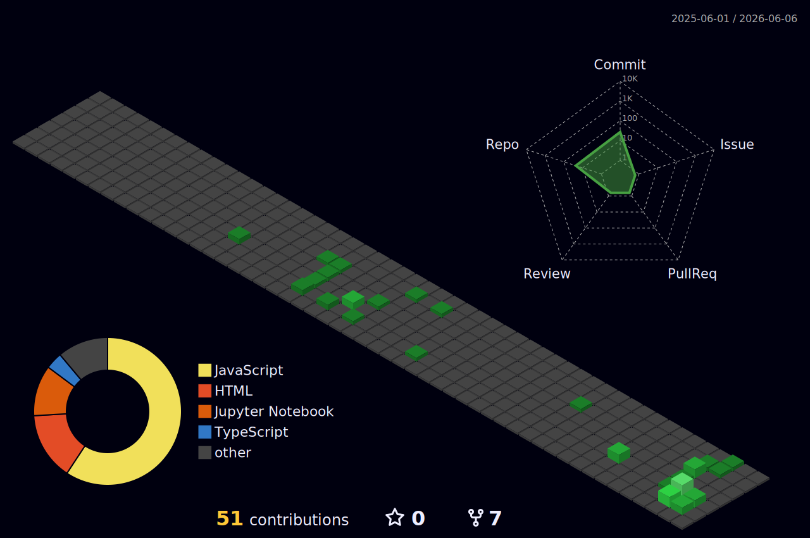

<div align="center">

<!-- HEADER -->


<!-- TYPING SVG -->
<a href="https://git.io/typing-svg"></a>

<br/>

<!-- SOCIAL BADGES -->
[](https://github.com/HaquHyup)
[](https://demodevhaqu.netlify.app)

</div>

---

##  About Me

```python
class Haqu:
    def __init__(self):
        self.name = "Haqu"
        self.role = "Full Stack Developer"
        self.team = "대모산 개발단"
        self.languages = ["Python", "JavaScript", "TypeScript", "Java"]
        self.frameworks = ["Django", "React", "Next.js", "Flutter"]
        self.databases = ["PostgreSQL", "MySQL", "Redis"]
        self.current_focus = "AI & Web Development"

    def say_hi(self):
        print("만나서 반갑습니다! 좋은 코드를 고민하는 개발자 하쿠입니다.")

me = Haqu()
me.say_hi()
```

---

##  Tech Stack

<div align="center">

### Main Technologies
<p>
  
</p>

### Also Working With
<p>
  
</p>

### Tools & Infrastructure
<p>
  
</p>

</div>

---

##  GitHub Analytics

<div align="center">
  
  
</div>

<br/>

<div align="center">
  
</div>

<br/>

<!-- ACTIVITY GRAPH -->
<div align="center">
  
</div>

---

##  3D Contribution Map

<div align="center">
  
</div>

---

## :snake: Contribution Snake

<div align="center">
  <picture>
    <source media="(prefers-color-scheme: dark)" srcset="https://raw.githubusercontent.com/HaquHyup/HaquHyup/output/github-snake-dark.svg" />
    <source media="(prefers-color-scheme: light)" srcset="https://raw.githubusercontent.com/HaquHyup/HaquHyup/output/github-snake.svg" />
    
  </picture>
</div>

---

## :trophy: GitHub Trophies

<div align="center">
  
</div>

---

<div align="center">

<!-- FOOTER -->


</div>
